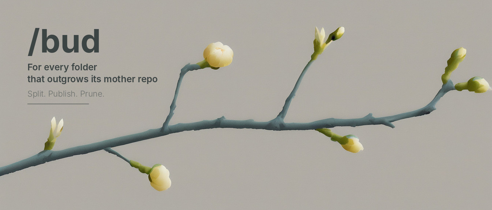

A [Claude Code](https://claude.ai/code) skill that graduates a subdirectory into its own GitHub repo — commit history intact — scaffolds it, and prunes it from the mother repo.

You sketched an MVP in a subfolder. It grew. Now it wants its own repo, its own issues, its own CI — and you'd rather not lose the twelve commits that got it there. That's one command.

## Install

```bash
claude plugins marketplace add kleer001/claude-slash-bud && claude plugins install bud
```

Requires `git` and an authenticated [`gh`](https://cli.github.com) CLI.

## Usage

| Command | What it does |
|---|---|
| `/bud <subdir>` | Split, publish, scaffold, prune — end to end |
| `/bud` | List the tracked top-level directories and ask which one |
| `/bud <subdir> --name NAME` | Repo name (default: the subdir's basename) |
| `/bud <subdir> --public` | Public repo (default: private) |
| `/bud <subdir> --dest DIR` | Clone location (default: sibling of the mother repo) |

Run it from inside the mother repo. Also triggers on phrases like "spin off", "extract", "graduate", or "split out" a subfolder.

## How it works

1. **Split** — `git subtree split` rewrites the subdirectory's history into a branch whose root *is* that folder.
2. **Publish** — creates the GitHub repo, pushes the split branch to `main`, clones it back to a fresh directory, and asserts that the clone carries every commit and every tracked file.
3. **Scaffold** — writes a README, `CLAUDE.md`, MIT `LICENSE`, and `.gitignore` from what the code actually is, skipping any that already exist. Commits, pushes, sets the repo description.
4. **Prune** — re-clones the new remote and re-checks every file, tags the mother `pre-bud/<name>-<stamp>`, bundles the whole mother repo to `~/.claude/bud-backups/`, then removes the directory, commits, and pushes.

## The safety contract

Nothing destructive runs until a fresh clone of the new remote is **proven** to contain every tracked file of the subdirectory. That check runs twice — once after publishing, again right before the cut — because the scaffolding step sits between them.

Before removing anything, the mother repo is tagged and bundled. Undo the prune with:

```bash
git reset --hard pre-bud/<name>-<stamp>
```

If any check fails, the run stops with the mother untouched. There are no fallbacks that "try another way" — a half-completed split that reports success is the one outcome worse than an error message.

## Honest caveats

- `git rm` prunes the tip, not the past — the subdirectory's blobs remain reachable in the mother's history. Expunging them is `git filter-repo` plus a force-push: a different operation, deliberately not automated here.
- `subtree split` follows only the prefix. Anything the subdirectory imported from elsewhere in the mother does not come along, so the new repo may not build until those are vendored.

## No network between the two sides?

Air gap, text-only channel, no GitHub — the history still travels as a file. See [`references/offline-transfer.md`](references/offline-transfer.md) for the `git bundle`, `fast-export`, and `format-patch` routes, plus the no-history shortcut.

See [`SKILL.md`](SKILL.md) for the full behavioral spec.

## Related

[`/bob`](https://github.com/kleer001/claude-slash-bob) — session handoff for Claude Code. Close the session, keep the thread.

## License

MIT — see [LICENSE](LICENSE).
